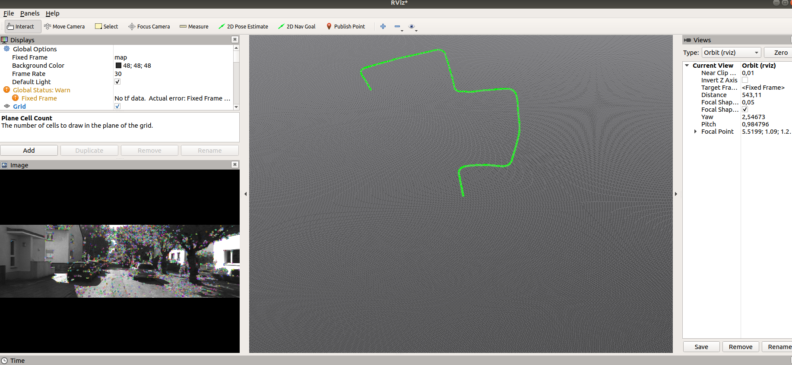

# Visual-Odometry-for-Monocular-Camera
6 DOF motion estimation using monocular vision

Result

This Repository contains Linux and windows code

Linux :
Tested on ROS melodic 18.04 
Code is tested with Kitti dataset you can download from 

http://www.cvlibs.net/datasets/kitti/raw_data.php

1) clone the repository
2) catkin_make // to build the project
3) roscore
4) source devel/setup.bash
5) rosrun point_demo point_demo.py
6) rosrun rviz rviz  // to visualize 

Windows :

python VO.py

Tips :
make sure you are given correct path for the input images
calibration parameter needs to correct one

Future Steps:
extend the process to stereo camera
